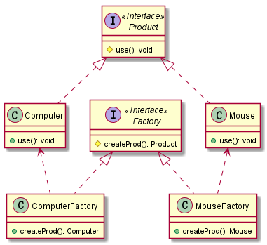

# 抽象工厂模式

### 定义
> 抽象工厂模式(Abstract Factory Pattern)：提供一个创建一系列相关或相互依赖对象的接口，
> 而无须指定它们具体的类。抽象工厂模式又称为Kit模式，属于对象创建型模式。

生成不同类产品，是对产品的抽象。

### uml类图

### 参考资料
- [design-patterns](https://design-patterns.readthedocs.io/zh_CN/latest/creational_patterns/abstract_factory.html)