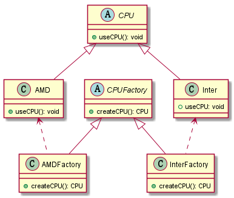

# 工厂方法模式

### 定义
> 工厂方法模式是简单工厂模式的进一步抽象和推广。
> 由于使用了面向对象的多态性，工厂方法模式保持了
> 简单工厂模式的优点，而且克服了它的缺点。在工厂
> 方法模式中，核心的工厂类不再负责所有产品的创建，
> 而是将具体创建工作交给子类去做。这个核心类仅仅
> 负责给出具体工厂必须实现的接口，而不负责哪一个
> 产品类被实例化这种细节，这使得工厂方法模式可以
> 允许系统在不修改工厂角色的情况下引进新产品。

生成同类产品的工厂，是对产品方法的抽象。

### uml类图
